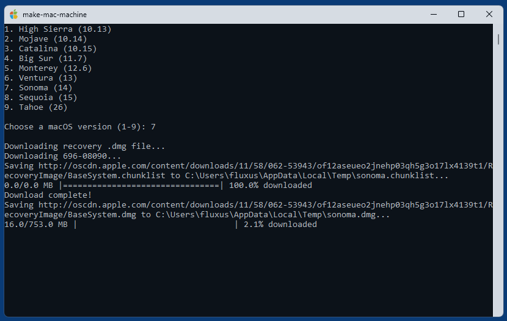

# make-mac-machine

A small cross-platform tool that allows to quickly create virtual macOS machines for VMware Workstation Pro (Windows and Linux) or VMware Fusion Pro (macOS) without requiring macOS installation media

## Available macOS versions

1. macOS 10.13 (High Sierra)
2. macOS 10.14 (Mojave)
3. macOS 10.15 (Catalina)
4. macOS 11 (Big Sur)
5. macOS 12 (Monterey)
6. macOS 13 (Ventura)
7. macOS 14 (Sonoma)
8. macOS 15 (Sequoia)
9. macOS 26 (Tahoe)

## Description

`make-mac-machine` allows to create virtual macOS machines for VMware Workstation 17.5 or later and VMware Fusion Pro 13.5 or later by using recovery images provided online by Apple. It's based on the [Python code](https://github.com/kholia/OSX-KVM/blob/master/fetch-macOS-v2.py) of repository [OSX-KVM](https://github.com/kholia/OSX-KVM/tree/master). You might want to check out section [Is This Legal?](https://github.com/kholia/OSX-KVM?tab=readme-ov-file#is-this-legal) in their [README](https://github.com/kholia/OSX-KVM/blob/master/README.md).
It also uses [dmg2img](http://vu1tur.eu.org/dmg2img) by Peter Wu and [QEMU](https://www.qemu.org/)'s disk image utility [qemu-img](https://qemu-project.gitlab.io/qemu/tools/qemu-img.html).

After selecting a macOS version the tool first downloads the corresponding recovery .dmg file (into the TMP directory), then converts it to an .img file using `dmg2img`, and then finally to a VMware disk image file (.vmdk) using `qemu-img`. The new virtual machine can then boot from this recovery disk image and macOS can be installed on the provided empty but prepartioned/preformatted main disk file `disk.vmdk` (volume "Macintosh HD", 40 GB). File `disk.vmdk` is only provided for convenience, so you can immediately start the macOS installation with "Reinstall macOS" without the need to first open Disk Utility and partition/format a disk.

The standalone release versions for Windows and macOS have tools `dmg2img` and `qemu-img` included, in Linux they have to be installed manually via package manager, see below.

## Prerequisites

### a) Windows
- Windows 10/11
- [VMware Workstation Pro 17.5](https://support.broadcom.com/group/ecx/productdownloads?subfamily=VMware+Workstation+Pro) or later, 25H2 recommended (now [free](https://blogs.vmware.com/workstation/2024/05/vmware-workstation-pro-now-available-free-for-personal-use.html) as in beer)
- macOS support in Workstation unlocked with DrDonk's [unlocker](https://github.com/DrDonk/unlocker/)  
  (Download [unlocker427.zip](https://github.com/DrDonk/unlocker/releases/tag/v4.2.7), unzip, go to subdir "windows" and run "unlock.exe")  
  Note: although Unlocker 4.2.7 was released in 2023, it works perfectly fine with latest version 25H2 of VMware Workstation Pro.
- Internet connection
- Current directory must be writable

### b) macOS
- Recent macOS system
- [VMware Fusion Pro 13.5](https://support.broadcom.com/group/ecx/productdownloads?subfamily=VMware+Fusion) or later, 25H2 recommended (now [free](https://blogs.vmware.com/workstation/2024/05/vmware-workstation-pro-now-available-free-for-personal-use.html) as in beer)
- Internet connection
- Current directory must be writable

### c) Linux
- [VMware Workstation Pro 17.5](https://support.broadcom.com/group/ecx/productdownloads?subfamily=VMware+Workstation+Pro) or later, 25H2 recommended (now [free](https://blogs.vmware.com/workstation/2024/05/vmware-workstation-pro-now-available-free-for-personal-use.html) as in beer)
- macOS support in Workstation unlocked with DrDonk's [unlocker](https://github.com/DrDonk/unlocker/)  
  (Download [unlocker427.tgz](https://github.com/DrDonk/unlocker/releases/tag/v4.2.7), extract, go to subdir "linux" and run `sudo ./unlock`)
- Internet connection
- Current directory must be writable
- Installation (for Debian-based distros):
  ```
  sudo apt-get install dmg2img qemu-utils
  git clone https://github.com/59de44955ebd/make-mac-machine.git
  cd make-mac-machine/src
  chmod +x main.py
  ln -s "$(realpath main.py)" ~/.local/bin/make-mac-machine
  # Or globally: sudo ln -s "$(realpath main.py)" /usr/local/bin/make-mac-machine
  ```

## Usage

- Run `make-mac-machine`, select a macOS version and wait until the tool completed
- There should now be a new virtual machine in a new folder `macOS-<version>` inside the current directory
- Open the .vmx file in this folder in Workstation resp. Fusion (if the tool failed to open it automatically) and start the machine
- Install macOS by clicking on "Reinstall macOS"
- Done.

After macOS was successfully installed, power off the machine, go to its settings and remove the installation disk "Hard Disk 2 (SATA)". You can also delete the file `recovery-<version>.vmdk` in the machine's folder since its not needed anymore.

## Post-Installation

Some hints for improving the performance of a freshly created macOS VM:

- Install [VMware Tools](https://packages-prod.broadcom.com/tools/frozen/darwin/) inside the macOS guest system: download [darwin.iso](https://packages-prod.broadcom.com/tools/frozen/darwin/darwin.iso) - or [darwinPre15.iso](https://packages-prod.broadcom.com/tools/frozen/darwin/darwinPre15.iso) in case of macOS 10.13 and 10.14 -, mount it as CD-ROM in the macOS guest and run the"Install VMware Tools.app".

- Turn off features in the macOS guest that waste CPU power by running this in macOS Terminal:

  ```
  # massively increase virtualized macOS performance by disabling spotlight (indexing)
  sudo mdutil -i off -a

  # reduce motion & transparency
  sudo defaults write com.apple.Accessibility DifferentiateWithoutColor -int 1
  sudo defaults write com.apple.Accessibility ReduceMotionEnabled -int 1
  sudo defaults write com.apple.universalaccess reduceMotion -int 1
  sudo defaults write com.apple.universalaccess reduceTransparency -int 1
  ```

## Screenshots




